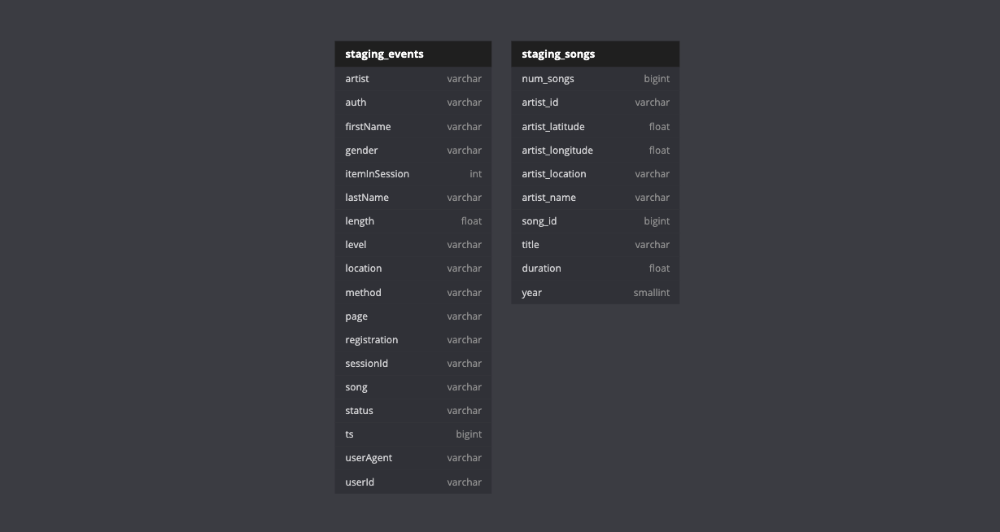
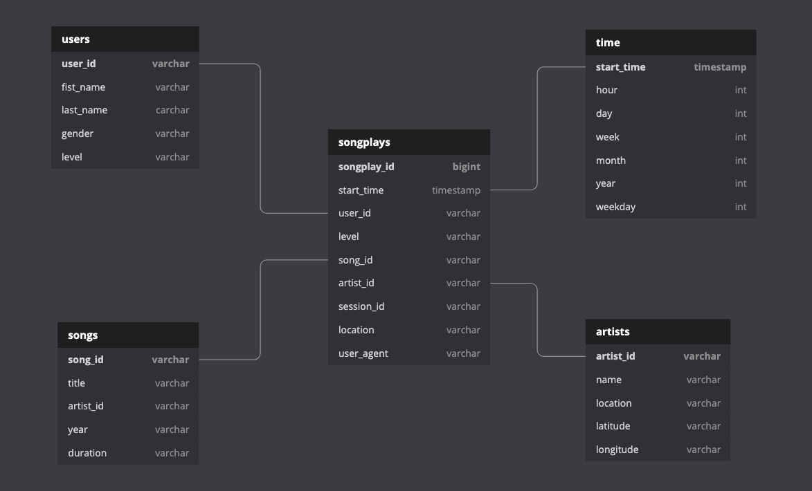

# Project description
As an evolution of [Project 2](https://github.com/hedcler/udacity-dataengineer-project2) Sparkify has grown their user base and song database and want to move their processes and data onto the cloud.

Their data resides in S3, in a directory of JSON logs on user activity on the app, as well as a directory with JSON metadata on the songs in their app.

As their data engineer, I was tasked with building an ETL pipeline that extracts their data from S3, stages them in Redshift, and transforms data into a set of dimensional tables for their analytics team to continue finding insights in what songs their users are listening to.

**1. Create infrastructure [OPTIONAL]**

**2. Design and create schemas**

**3. Build ETL Pipeline**

## Project structure
We have a file called `sql_queries.py` with all SQL Queries used in the project, a file called `create_tables.py` that start/restart the database structure on postgres, and a file called `etl.py` that execute the process of read all files and migrate their data in a strucured way for our database.

**Optionally** we can use the file `iac.py` tha will create AWS needed infrastructure, if you don't do it yet. This file will also update the configuration file with the cluster variables.
## Step 1 - Configure the project
You will need to copy the `dhw.cfg.example` to `dhw.cfg` and update the destination file with your AWS Credentials and configuration.

**Optionally** you can set a cluster configuration on `IAC` section and run the file `iac.py` to create your cluster and update configuration file.
## Step 2 - The Schema

First of all, we import data from S3 to a staging schema, that is load by kind of data

**Schema representation**



As an evolution, we create our schema optimized for queries on song play analysis. This includes the following tables:

**Fact Table**

1. songplays - Records in event data associated with song plays i.e. records with page NextSong *(fields: songplay_id, start_time, user_id, level, song_id, artist_id, session_id, location, user_agent)*


**Dimension Tables**

2. **users**: Users in the app *(fields: user_id, first_name, last_name, gender, level)*

3. **songs**: Songs in music database *fields: song_id, title, artist_id, year, duration*

4. **artists**: Artists in music database *(fields: artist_id, name, location, lattitude, longitude)*

5. **time**: Timestamps of records in songplays broken down into specific units
*(fields: start_time, hour, day, week, month, year, weekday)*


**Schema representation**



## Step 2 - Reading the data
### Song Dataset
The songs dataset is a subset of real data from the [Million Song Dataset](https://labrosa.ee.columbia.edu/millionsong). Each file is in JSON format and contains metadata about a song and the artist of that song. The files are partitioned by the first three letters of each song's track ID. For example, here are filepaths to two files in this dataset.

```
song_data/A/A/B/TRAABJL12903CDCF1A.json
song_data/A/B/C/TRABCEI128F424C983.json
```

And below is an example of what a single song file, TRAABJL12903CDCF1A.json, looks like.

```
{"num_songs": 1, "artist_id": "ARJIE2Y1187B994AB7", "artist_latitude": null, "artist_longitude": null, "artist_location": "", "artist_name": "Line Renaud", "song_id": "SOUPIRU12A6D4FA1E1", "title": "Der Kleine Dompfaff", "duration": 152.92036, "year": 0}
```

**IMPORTANT:** As a example we will work with the first 100 partitions. From partition [A/A/A] to partition [A/D/V], but you can update the file `etl.py` on line `15` to load all partitions.

### Log Dataset

The log dataset consists of log files in JSON format generated by this event simulator based on the songs in the dataset above. These simulate app activity logs from an imaginary music streaming app based on configuration settings.

The log files in the dataset you'll be working with are partitioned by year and month. For example, here are filepaths to two files in this dataset.

```
log_data/2018/11/2018-11-12-events.json
log_data/2018/11/2018-11-13-events.json
```

And below is an example of what the data in a log file, 2018-11-12-events.json, looks like.


## Step 3 - Execution

You need to do in order:

1. Rename the `dwh.cfg.example` to `dwh.cfg`
2. Update the configuration on `dwh.cfg` or execute the file `iac.py`, that will create infrastructure and update configurations
3. Execute the file `create_tables.py` that will import queris from `sql_queries.py`
4. Execute the file `etl.py` to import data to our Redshift Data Warehouse.

To execute `iac.py` you'll need to provide `key`, `secret`, and `region` on `[AWS]` section of file `dwh.cfg`.

Now you can explore the file `data_explorer.ipynb` that has some queries, and you can make your own.

